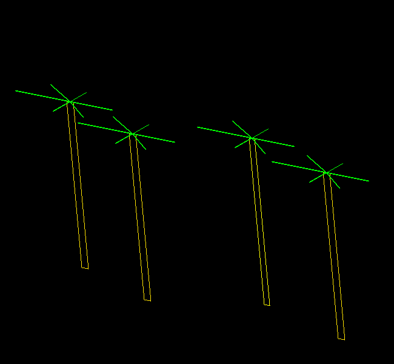

# ImageMatrixTransform
Lightweight tool for affine graphics transformation and image interpolation using Lanczos algorithm.

## Features:
- support for custom vector images
- support for multiple bitmap images
- loading and multiplying multiple matrices from file
- image interpolation using Lanczos algorithm

### Vector image file syntax:
Header:
`#GK3`
Polygon specification:
`polygon:`
Color:
`color:`
Points:
```
points:
    X1 Y1
    X2 Y2
```

##### Example
```
#GK3

polygon:
  	color: 255 255 0
  	points:
    		515.0 250.0
    		515.0 500.0
```

### Matrix file syntax:
```
[
	a b c
	d e f
	g h i
]
```
Matrix file can contain multiple matrices. All of the matrices will be combined before applying transformation to an image .




